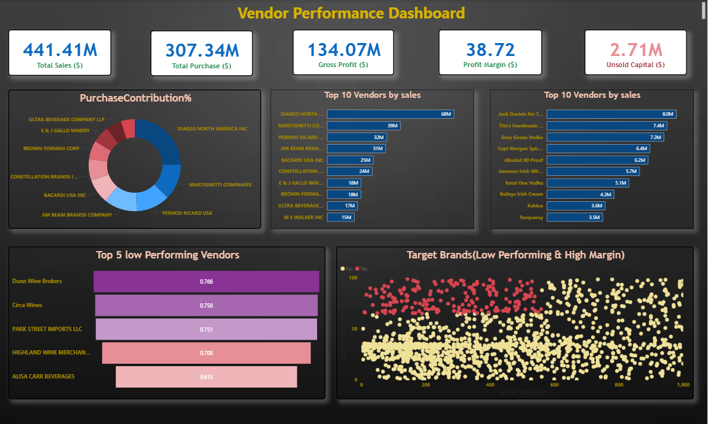

# 📊 Vendor Performance Data Analytics

This project demonstrates an end-to-end **data pipeline** and **analysis workflow** for evaluating vendor performance.  
It covers **data ingestion, SQL transformations, Python-based exploratory analysis, and an interactive Power BI dashboard**.  

---

## 📂 Project Structure

```
Vendor Performance Data Analytics/
│
├── Data1/ # Raw CSV files (You can download from the link given below)
│
├── ingestion.py # Script to load CSV data into SQLite DB
├── get_vendor_summary-checkpoint.py # Script to create vendor summary table
│
├── Exploratory data analysis-checkpoint.ipynb # Initial SQL queries & EDA
├── Vendor Performance Analysis.ipynb # Python-based analysis (EDA + plots)
│
├── Vendor Performance Dashboard.pbix # Power BI dashboard file
├── Vendor Performance Dashboard.png # Power BI dashboard preview
│
├── plots/ # Visualization(s) for README
│ └── Vendor_Performance_Dashboard.png
│
└── README.md # Project documentation
```

## Dataset

The original dataset used in this project is quite large (>1GB) and therefore not included directly in this repository due to GitHub's size limitations.  

🔗 You can download the complete dataset from Google Drive: [Download Dataset](https://drive.google.com/file/d/1Uu1UCnJOnbHapZdOyYrafjHC_UuHMb5a/view?usp=drivesdk)  

For demonstration purposes, the project code works with the same folder structure and can run with the downloaded data once placed inside the `Data1/` directory.


---

## 🚀 Project Workflow

1. **Raw Data (CSV files)**  
   - Stored in the `Data1/` folder.  
   - Contains vendor, sales, purchases, and invoice datasets.  

2. **Data Ingestion (`ingestion.py`)**  
   - Reads all CSV files from `Data1/`.  
   - Loads them into an **SQLite database (`inventory.db`)** as raw tables.  

3. **Exploratory Data Analysis (`Exploratory data analysis-checkpoint.ipynb`)**  
   - Runs SQL queries on the ingested database.  
   - Performs early analysis and validation of raw data.  

4. **Vendor Summary (`get_vendor_summary-checkpoint.py`)**  
   - Merges multiple tables (`purchases`, `sales`, `vendor_invoice`).  
   - Cleans and enriches the data with new metrics (Gross Profit, Profit Margin, Stock Turnover, Sales-to-Purchase Ratio).  
   - Saves the summary table (`vendor_sales_summary`) back into the database.  

5. **Python Analysis (`Vendor Performance Analysis.ipynb`)**  
   - Detailed analysis using **Pandas, Matplotlib, and Seaborn**.  
   - Generated supporting insights for vendor performance.  

6. **Power BI Dashboard**  
   - `Vendor Performance Dashboard.pbix` → interactive dashboard.  
   - `Vendor Performance Dashboard.png` & `plots/Vendor_Performance_Dashboard.png` → preview image.  

---

## 📊 Project Flow

**CSV files → ingestion.py → SQLite DB (raw tables) → get_vendor_summary.py → SQLite DB (summary table) → Jupyter Notebook Analysis → Power BI Dashboard**

---

## 📈 Dashboard Preview

Here is the final **Vendor Performance Dashboard** built in Power BI:



---

## 🛠️ Tools & Technologies
- **Python**: Pandas, SQLAlchemy, Matplotlib, Seaborn  
- **SQL**: SQLite (via SQLAlchemy)  
- **Jupyter Notebook**: Exploratory and Python analysis  
- **Power BI**: Dashboard creation and visualization  
- **Logging**: For pipeline monitoring  

---

## ✅ Key Insights
- Built a **repeatable ingestion pipeline** for raw CSVs into a database.  
- Designed a **vendor-level summary table** for analysis.  
- Performed **Python-based analysis and visual checks**.  
- Created an **interactive Power BI dashboard** to present findings.  

---

## 👨‍💻 Author
- **Jayant**  

---
